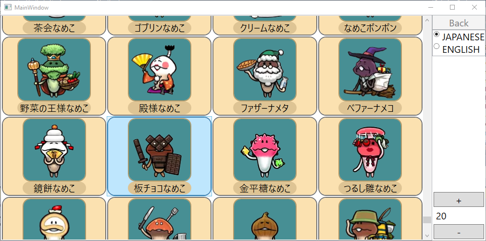
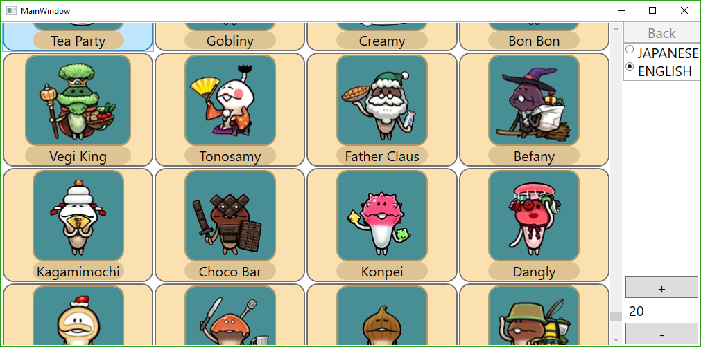
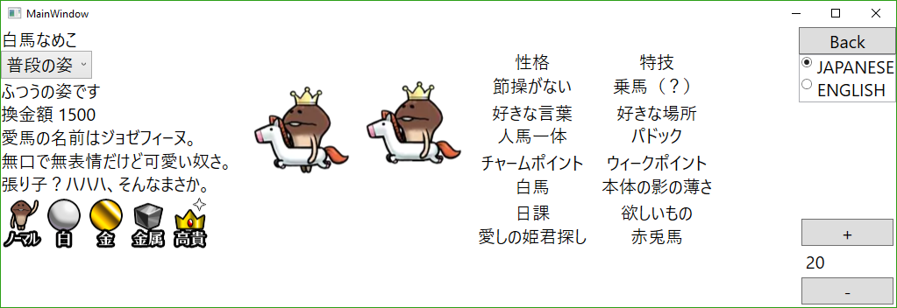
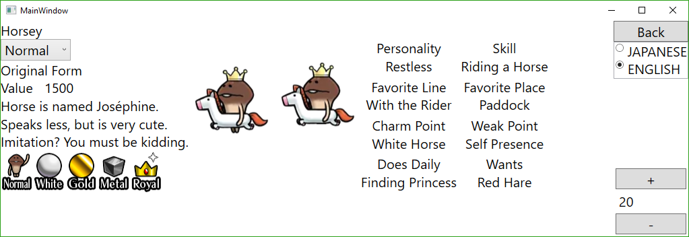
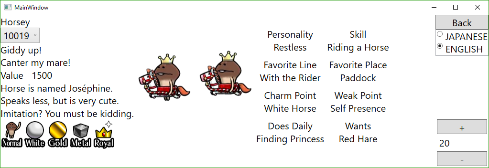
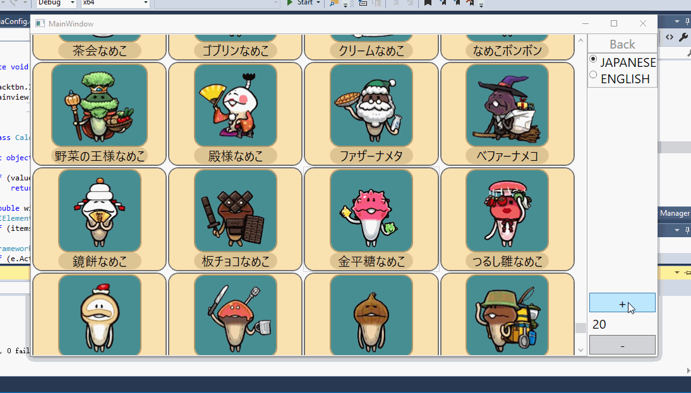

# Mushroom Garden Neo Data Extractor and Viewer (Alpha)

Extract data from the ipa package of Mushroom Garden Neo (なめこ栽培NEO) and display with GUI written in WPF.

Currently only nameko(mushrooms) data are extracted.

Dependencies: (available on Nuget)
- MsgPack.Cli 1.0.0
- Imazen.WebP 10.0.1.0

## Details

Text and attribute data for all nameko is packed in the file `library.bin` in the ipa package. Japanses data and English data alternate in the file. By inspecting the executable it can be concluded that Msgpack is used to create the file. The meaning of most data fields have been identified --- check [NeoReader.cs](../src/NeoReader.cs) for more information.

Images of nameko are all in webp formats. Each nameko has three images, one for growing on logs, one for harvest, and one for the library. These images are indexed by nameko ids.

Some nameko have alternative forms for different themes, but only theme ids can be found in `library.bin`. To get theme titles, one has to extract theme data from `tm.bin`, which is not done here.

Nameko type information is encoded as bitfields. The order of the type in the bitfields is consistent with the order of the type sprites.

## Viewer(alpha)

The viewer is able to change the display language on the fly.

The nameko list is a flowable data grid.

